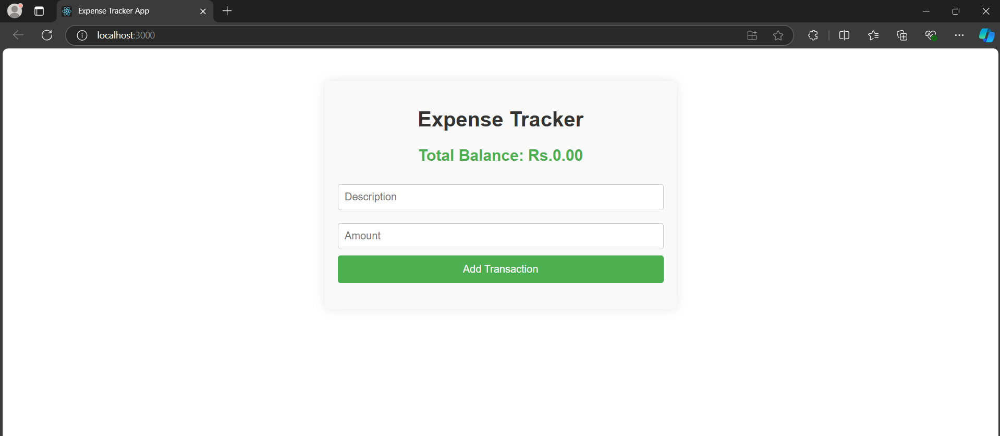
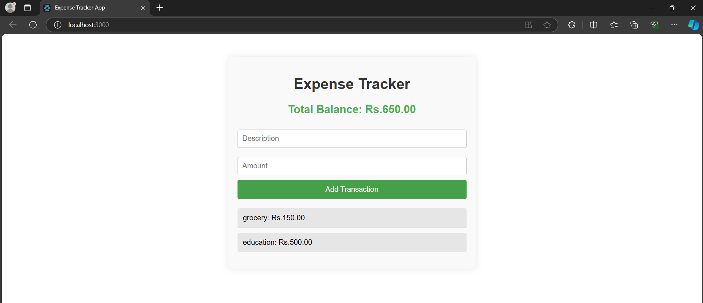

# Expense-Tracker-App
<br>
A simple Expense Tracker application built with React that allows users to add, view their expenses. This app helps users keep track of their financial transactions and calculate their total balance.
<br>
<h1>Features</h1>
<br>
  - Add new transactions with descriptions and amounts.<br>
  - View a list of all transactions.<br>
  - Calculate and display the total balance.

<br>
<h1>Screenshots</h1>
<br>
<div align="center">
     
</div>
<br>
<div align="center">
     
</div>
<br>
<h1>Technologies Used</h1>
<br>
  - React: JavaScript library for building user interfaces.
  <br>
  - CSS: For styling the application.
<br>
<h1>Prerequisites</h1>
Make sure you have Node.js and npm installed on your machine.
<br>

<h1>Installation</h1>
<br>
###  Clone the project
<br>
``` bash
git clone https://github.com/deepak-terse/nearme-app.git
cd nearme-app
```
